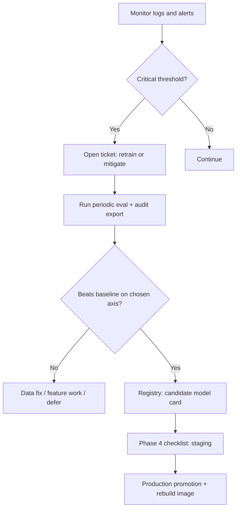

# Phase 6 — Retraining Workflow (Policy + Triggers)

**Scope:** TF-IDF baseline today; future **trainable** models follow the same governance loop. Retraining here means **refresh evaluation, data, or model artifacts** — not automatic GPU jobs in this repo.

## Inputs

| Input | Source |
| --- | --- |
| Policy thresholds | `config/monitoring_thresholds.json` |
| Promotion rules | `config/promotion_criteria.json` |
| Baseline metrics | `artifacts/phase2_baseline_reference.json`, `artifacts/phase3_comparison.json` |

## Trigger types

1. **Monitoring (automated signal)** — Critical alerts fire (latency, error rate, fallback rate) per dashboard spec.
2. **Quality decay (scheduled)** — Periodic eval (`scripts/run_periodic_eval.py`) shows Top-1 / MRR drop vs baseline beyond `drift_and_quality` thresholds.
3. **Drift (proxy)** — Input length distribution shift, language mix change, or job description updates (manual review until live telemetry exists).
4. **Manual** — Ticket / thesis committee / product owner requests retrain or data refresh.

## Workflow (recommended)

## Roles

| Role | Action |
| --- | --- |
| **On-call / SRE** | Acknowledge alerts; scale or rollback (`docs/rollback-runbook.md`). |
| **ML owner** | Runs eval scripts; updates model cards; proposes registry promotion. |
| **Approver** | Signs off Phase 4 checklist for staging/production. |

## Retraining steps (concrete)

1. **Freeze incident context** — snapshot logs, alert time range, `request_id` samples.
2. **Run** `python scripts/run_periodic_eval.py` — regenerates Phase 2/3 artifacts and `artifacts/periodic_eval_<timestamp>/`.
3. **Run** `python scripts/export_audit_package.py` — audit bundle for thesis / compliance.
4. **If** new model artifact: place under `artifacts/phase3_models/` or external store; update model card paths.
5. **Update** `registry/` per `docs/phase4-promotion-checklist.md`.
6. **Rebuild / redeploy** Docker image or mount updated registry (`docs/deployment-guide.md`).

## What this repo does *not* automate

- Kubernetes Job for training clusters.
- Auto-merge to production without human approval (per `retraining_triggers.manual_ticket_required` in monitoring config).
